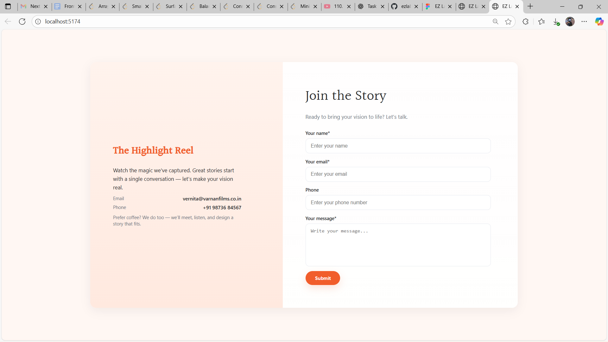
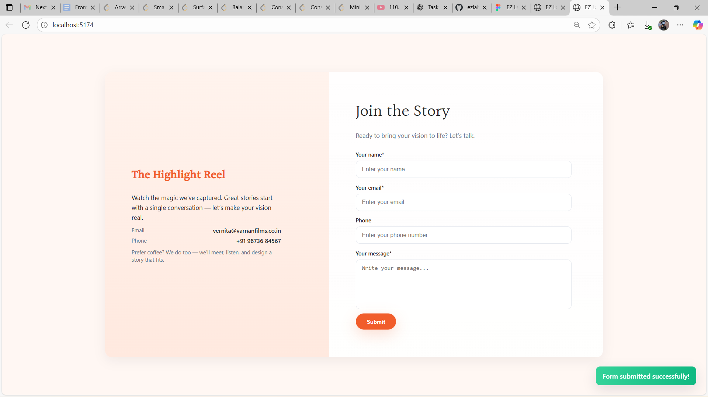
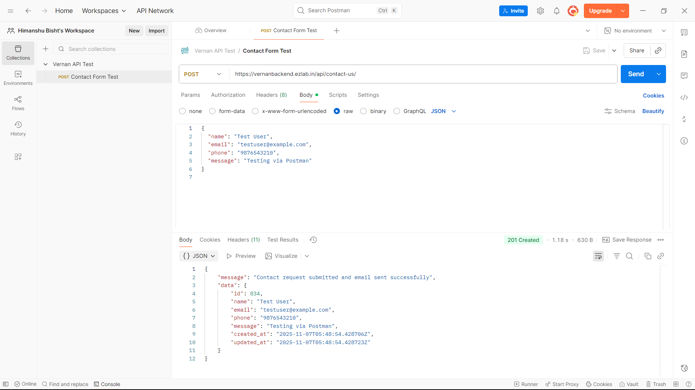

# EZ Labs - Contact Form (React)

This is a small React single-page application that recreates the provided design and integrates with the provided API endpoint.

## 🏠 Preview


## Features
- Responsive layout (tested for mobile and desktop breakpoints described in task).
- Front-end validation for empty fields and email format.
- Submits data to `https://vernanbackend.ezlab.in/api/contact-us/` via POST.
- Shows "Form Submitted" when API returns status 200 or OK.



## Run locally
Requirements: Node 18+ recommended.

1. Extract the project and `cd ezlabs_assignment`
2. Install dependencies:
```bash
npm install
```
3. Start dev server:
```bash
npm run dev
```
4. Open the URL shown by Vite (usually http://localhost:5173)

## Files of interest
- `src/App.jsx` - main app & form logic
- `src/styles.css` - styling & responsive rules
- `postman_dump/vernan_contact_test.json` - Postman collection you can import

## Postman / Testing
A Postman collection is included (`vernan_contact_test.json`) with a POST request preconfigured to the API endpoint.

## Tech Stack
- React.js (Functional Components)
- CSS3 (Responsive Flex & Grid)
- Fetch API for backend integration

---

## API
**POST URL:**  
`https://vernanbackend.ezlab.in/api/contact-us/`

**Example Request:**
```json
{
  "name": "Test User",
  "email": "testuser@example.com",
  "phone": "9876543210",
  "message": "Testing via Postman"
}

